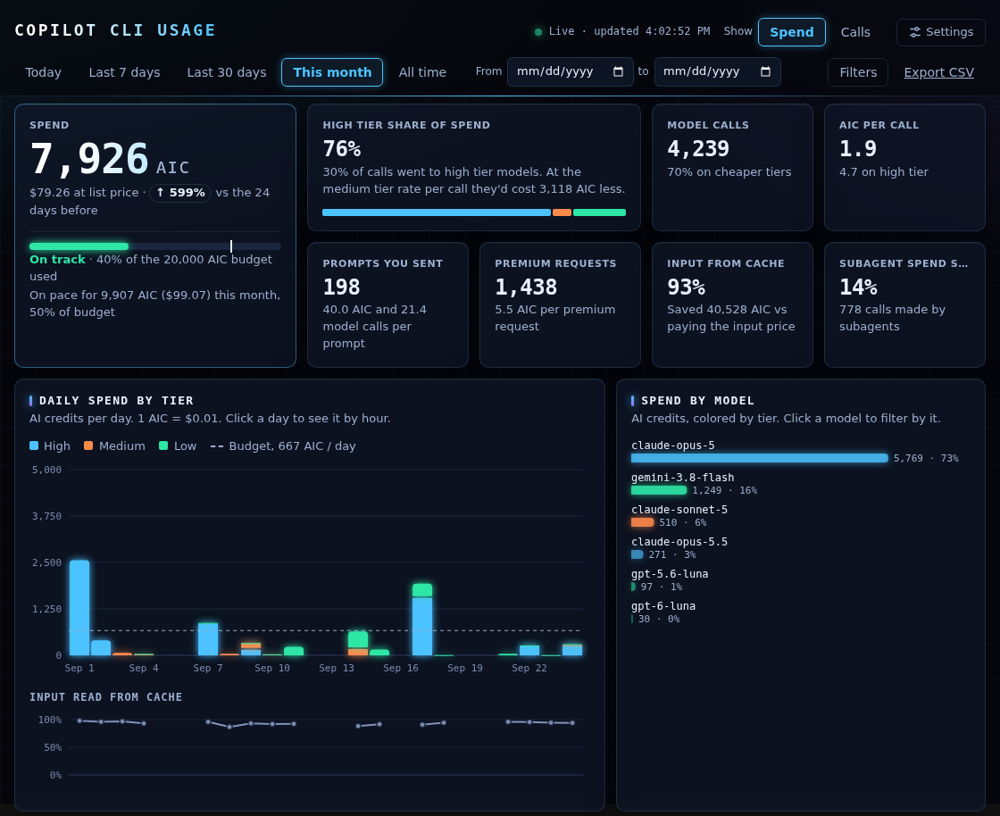
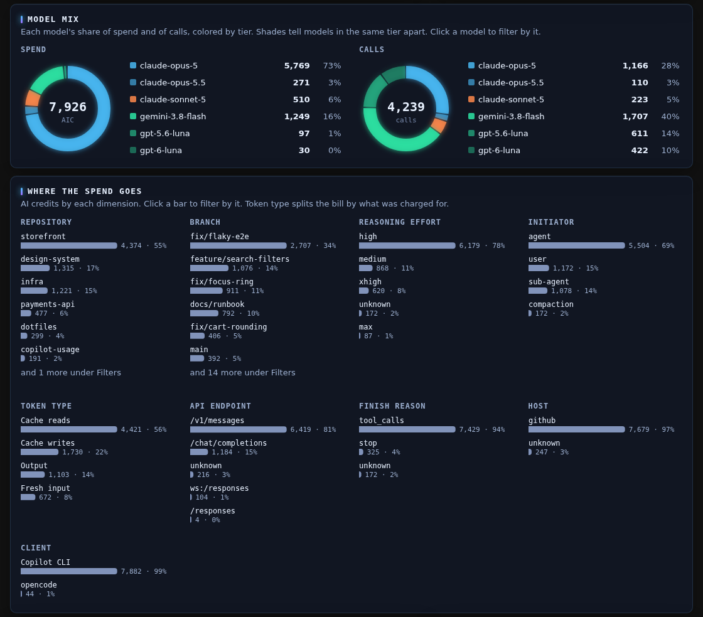
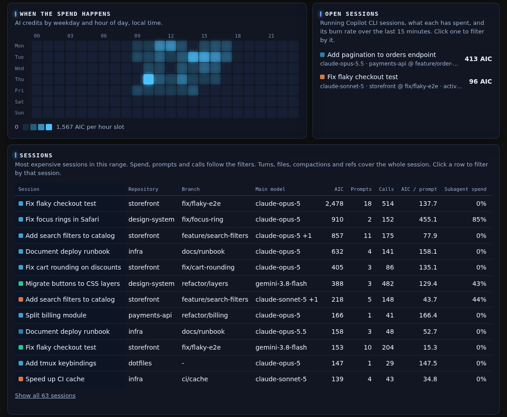
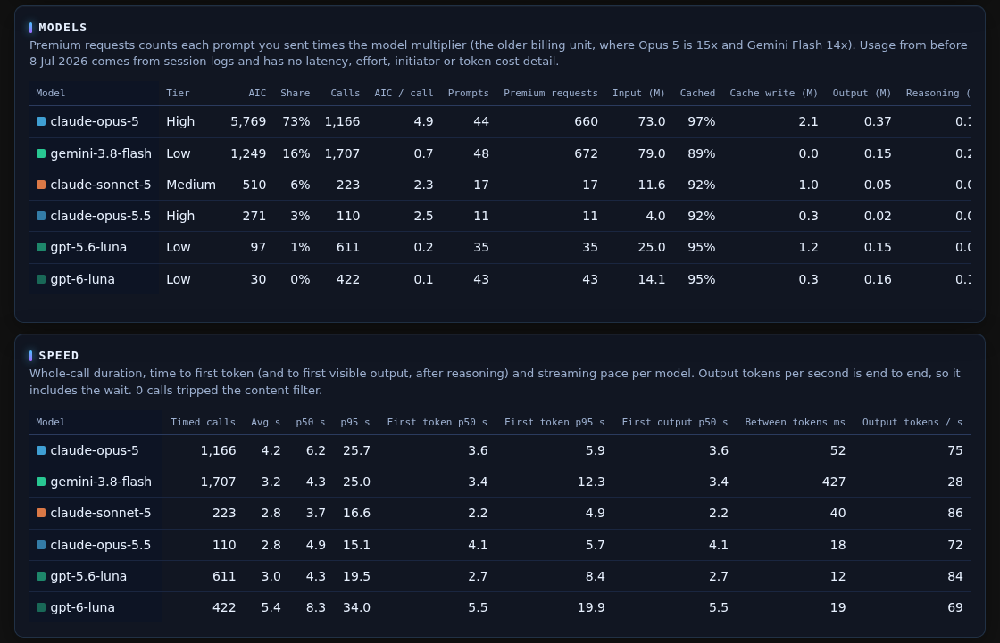

# copilot-usage

Local stats for GitHub Copilot CLI (and opencode on the Copilot provider): AI credits, calls and tokens per model, read from `~/.copilot/session-store.db` and `~/.copilot/session-state/*/events.jsonl`. Nothing leaves the machine. Python 3.9+ stdlib only, no build step.



## Usage

```sh
ln -sf "$PWD/bin/copilot-usage" ~/.local/bin/copilot-usage   # or run: python3 -m copilot_usage

copilot-usage                                  # table per month
copilot-usage --by day --since 2026-09-01      # or --by repo, --by branch
copilot-usage serve                            # live dashboard at http://localhost:8765
copilot-usage serve --budget 25000             # also track a monthly AIC budget
```

## How the numbers are derived

- 1 AIC = 1e9 `totalNanoAiu` = $0.01.
- `session-store.db` has one row per model call in `assistant_usage_events` (model, tokens, nanoAIU, reasoning effort, initiator, latency, request multiplier). This is the primary source, and it exists from CLI ~1.0.7x onwards.
- Spend a session made before its first database row comes from `events.jsonl`: per-model totals on `session.shutdown`, with `session.usage_checkpoint` running totals credited to the active model in between. Those counters sometimes restart after a resume, so a drop is treated as a fresh counter. Sessions that were killed never wrote a shutdown, so log-only periods undercount.
- Premium requests = request multiplier summed over user-initiated calls only, which is how the older premium-request billing counts.
- Only Copilot CLI and opencode on this machine are covered. VS Code, github.com chat and the coding agent bill to the same account but don't log here.

## opencode

Sessions that use the `github-copilot` provider are read from `~/.local/share/opencode/opencode.db` (opencode 2.x) and show up under Client = opencode.

- opencode's own `cost` leaves out cache writes, so each call is re-priced with the per-token rates Copilot CLI last logged for that model. Models Copilot CLI never used fall back to opencode's `cost`, which undercounts.
- The first call after a prompt counts as user-initiated, later ones as agent, and calls from child sessions as sub-agent (credited to the root session).
- Repository comes from the directory's `origin` remote. opencode doesn't record the branch, and its sessions don't appear under open sessions.

## Dashboard

Screenshots use mock data.







- Filters (date range, tier, model, repository, branch, effort, initiator, API endpoint, finish reason, host, session) live in the URL hash, so a view can be bookmarked. Bars, table rows and open sessions are clickable filters. Clicking a day switches the spend chart to hours. "Show" switches the tier chart, tier share, model bars, breakdowns and heatmap between spend and calls. The model mix donuts always show both.
- Spend is compared with the window of the same length right before it, and "This month" adds a month-end projection (against `--budget` if set).
- Token type splits the bill using the per-call price list in `token_details_json`. Cache savings are the cache reads re-priced at that call's input rate.
- Prompts are user-initiated calls. Subagent spend is calls with initiator `sub-agent`, and the subagent count is distinct `agent_id`s.
- The sessions table joins `sessions`, `turns`, `session_files`, `checkpoints` and `session_refs`. Those counts cover the whole session, not the selected range. A failed-commands column shows up once `forge_trajectory_events` has rows.
- Latency percentiles come from raw per-call durations. The page only re-downloads the data when the database or a session log changed.
- Export CSV downloads the filtered rows.

## Tiers

High, medium and low are guessed from model names by `TIER_RULES` in `copilot_usage/config.py`. Edit it to match how your org classifies models.

## Layout

```
bin/copilot-usage          launcher, resolves symlinks to find the package
copilot_usage/
  cli.py                   argument parsing and the terminal table
  config.py                paths, units and TIER_RULES
  session_store.py         per-call rows from session-store.db
  session_logs.py          events.jsonl parsing for older sessions
  opencode.py              opencode.db sessions on the Copilot provider
  records.py, cache.py     shared record shape and file-change cache
  usage.py                 merges sources and builds the API payload
  server.py                serves /api/usage and the web/ folder
  web/
    index.html
    css/                   themes, base layout, header, settings, KPIs, charts, tables
    js/                    ES modules, main.js is the entry point, charts/ holds each chart
docs/                      README screenshots (mock data)
```
